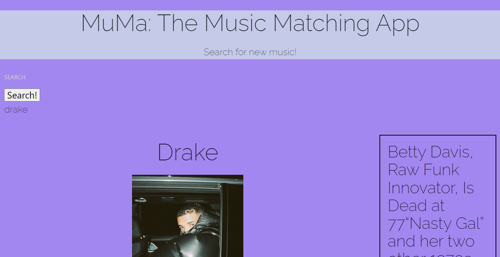
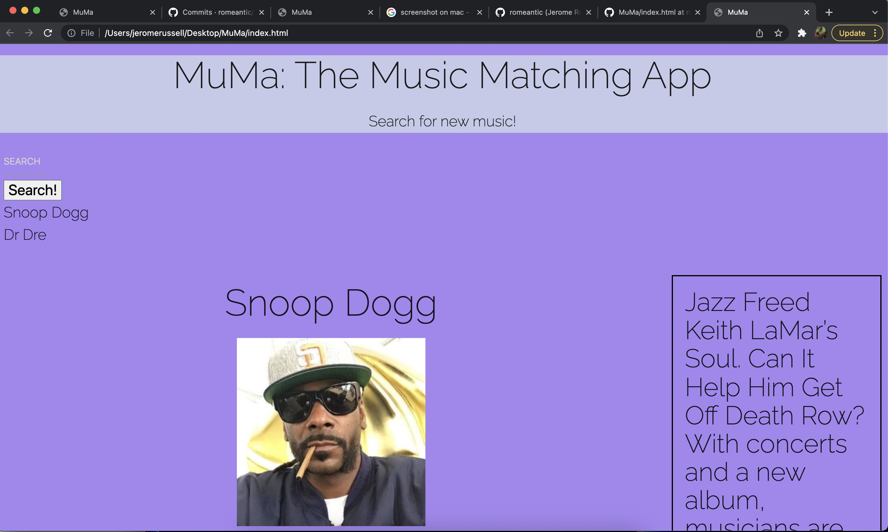

# MuMa: The Music Matching App.

## User Story

AS A listener
I WANT to input artist name
SO THAT we can see their top 5 albums and songs and daily music news

## Description

A site that allows you to search artist and see their top 5 songs and albums and a daily music news.

## Links

active link: https://hazel-jimenez.github.io/MuMa/

github repo link: https://github.com/hazel-jimenez/MuMa

## Authors

Contributors names and contact info

Hazel Jimenez
[@hazel-jimenez](https://github.com/hazel-jimenez/)

Jared Pennington
[@jaredpennington](https://github.com/jaredpennington)

Alex Campbell
[@Acampbell8610](https://github.com/Acampbell8610)

Jerome Russell
[@Romeantic](https://github.com/Romeantic)

Santiago Hurtado
[@bompilori](https://github.com/bompilori)

## Version History

- 0.1
  - Initial Release
